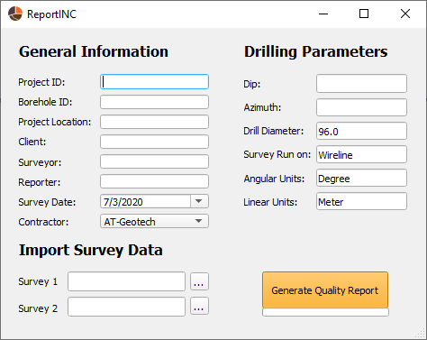

# ReportINC
 
Generating PDF QC reports based on the survey data of REFLEX GYRO Inclinometer. 

# 1. Why is it so important?
All boreholes deviate!

Drilling is an extremely expensive process and it is not acceptable to deviate too much from the planned drill trajectory.
The main role of ReportINC is to analyze the raw data and produce valuable results.

# 2. How does it work?
ReportINC takes the raw data (CSV) of Gyro as an input and generates 2 separate PDFs:

1. GYRO QC report;

It demonstrates the quality of the survey based on IN and OUT surveys.

2. Drilling report.

It shows the deviation of the borehole from its planned path. 

# 3. Which technologies have been used?

The main script has been written in Python and its libraries as listed below:

1. Pandas - for reading the raw data;
2. Numpy - for calculations;
3. Matplotlib - for plots;
4. Reportlab - for generating reports.

GUI has been created with PyQt5

# 4. What is next?

I occasionally update the program and add new features.

It is only compatible with REFLEX GYRO for now, however, I intend to add other inclinometers that are widely used in Mining industry.

